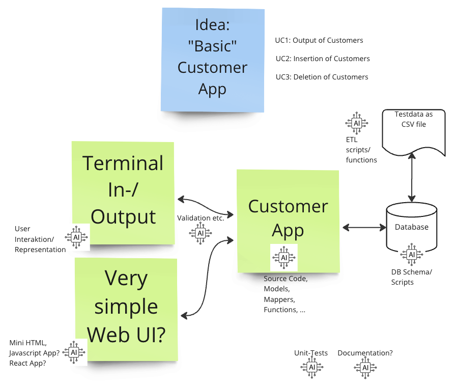
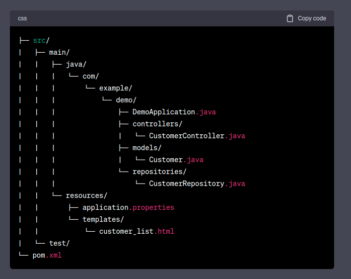

# chatgpt-customer-app-experiment
This is a basic application that was developed as an experiment for using ChatGPT for programming.

# Experiment Overview

# Database schema
Creation of the Database schema: `database/schema.sql`.
### What ChatGPT did?
* Generated the CREATE-TABLE statement
  * Changed the data types (varchar, boolean)
  * Changed the table name and column names to English
  * Changed all column names snake_case
  * Added street_number column
* Generated CREATE DATABASE and CREATE USER/ PRIVILEGES scripts

### What did we do?
* Mysql-Database setup and manual import of schema scripts
* Generate password for the user

### Problems
* Data Types not optimal selected (e.g. VARCHAR length)
* The username included "@'localhost'". This didn't within the database-container.

# Setup of database by Docker
### What ChatGPT did?
* Generated the docker-compose.yml for us
* Added missing variables etc.
* Explained the difference between docker-compose/ dockerfile
* Added an init sql script and command to the docker-compose

### What did we do?
* Checked the script and changed the variables
* Troubleshooting with help of ChatGPT

### Problems
* Generated docker-compose.yml differed between conversations/ languages

# Database import script (Python)
Creation of an import script `import.py`.

### What ChatGPT did?
* Wrote Python script for insertion of CSV file `customers.csv`
* Split up of street into street name and house number
* Formatting of the date field
* Converted column newsletter values 'ja' -> 1, 'nein' -> 0
* Created Database connection and insert command
* Applied Clean Code principles
* Rewritten psycopg2-connection to mysql-connection (after hint)

### What did we do?
* We had to fix the source code and the handling of connections and cursors
* Source code was sometimes not that readable and clean
* Date converting source code is very "technically" inspired

### Problems
* Asking for Clean Code principles ChatGPT broke the database connection
* ChatGPT assumed Postgres (psycopg2) first, we had to explicitly mention MySQL-DB (mysql-connector)
* ChatGPT not understood that we wanted a `requirements.txt` file with needed modules

# Spring-Boot project
Creation of a spring boot application using maven

### What ChatGPT did?
* Explained how we can create a spring boot application using Maven and Spring Boot Initializer
* Created code/classes and configuration files for a basic Spring Boot project with Mysql CRUD-Access
* printed the required imports after asking for them
* explained where to put the thymeleaf files and printed an example folder structure:

* suggested a basic html site (Thymeleaf) for customer display
* created the config to access the local database
* created the getter and setter for the customer variables, which where "omitted for brevity"

### What did we do?
* remove local resource attribute from the Maven command
* local Maven setup troubleshooting
  * added missing dependencies with versions
  * maven config and IDE setup

### Problems
* initial Maven command was set to search for a Maven archetype locally
* import statements and dependencies missing in the code examples