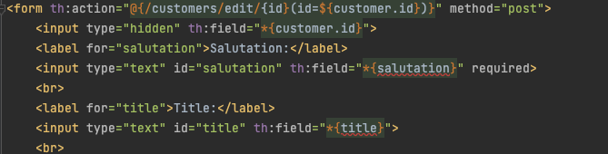
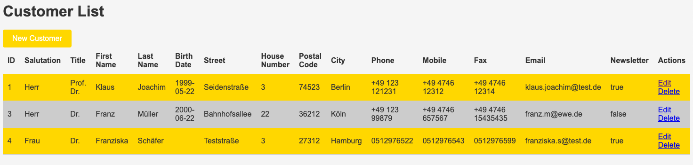
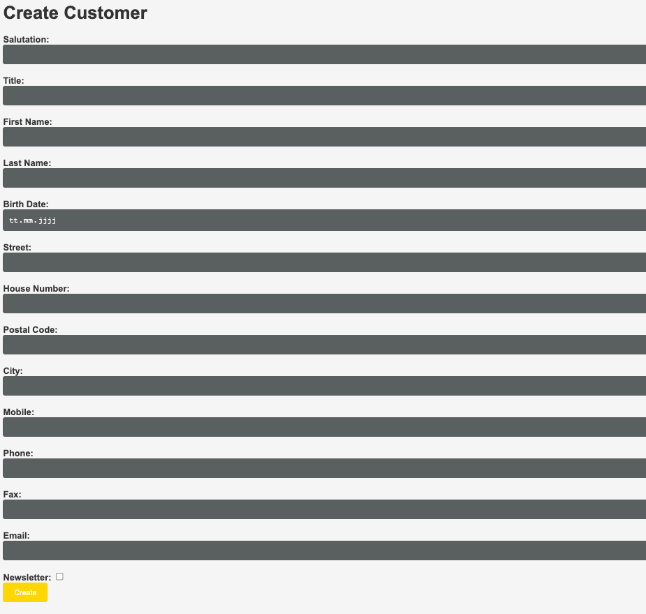
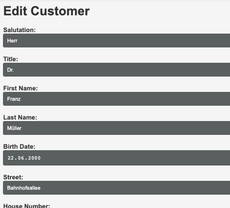
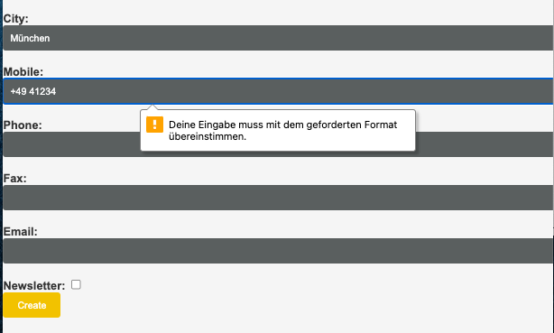
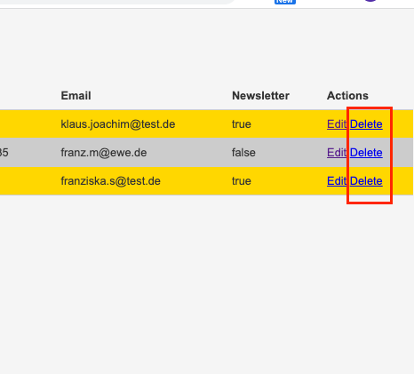

# chatgpt-customer-app-experiment
This is a basic application that was developed as an experiment for using ChatGPT for programming. As technology Spring Boot Framework with Java and Thymeleaf is used.

# Experiment Overview

# Database schema
Creation of the Database schema: `database/schema.sql`.
### What ChatGPT did?
* Generated the CREATE-TABLE statement
  * Changed the data types (varchar, boolean)
  * Changed the table name and column names to English
  * Changed all column names snake_case
  * Added street_number column
* Generated CREATE DATABASE and CREATE USER/ PRIVILEGES scripts

### What did we do?
* Mysql-Database setup and manual import of schema scripts
* Generate password for the user

### Problems
* Data Types not optimal selected (e.g. VARCHAR length)
* The username included "@'localhost'". This didn't within the database-container.

# Setup of database by Docker
### What ChatGPT did?
* Generated the docker-compose.yml for us
* Added missing variables etc.
* Explained the difference between docker-compose/ dockerfile
* Added an init sql script and command to the docker-compose

### What did we do?
* Checked the script and changed the variables
* Troubleshooting with help of ChatGPT

### Problems
* Generated docker-compose.yml differed between conversations/ languages

# Database import script (Python)
Creation of an import script `import.py`.

### What ChatGPT did?
* Wrote Python script for insertion of CSV file `customers.csv`
* Split up of street into street name and house number
* Formatting of the date field
* Converted column newsletter values 'ja' -> 1, 'nein' -> 0
* Created Database connection and insert command
* Applied Clean Code principles
* Rewritten psycopg2-connection to mysql-connection (after hint)

### What did we do?
* We had to fix the source code and the handling of connections and cursors
* Source code was sometimes not that readable and clean
* Date converting source code is very "technically" inspired

### Problems
* Asking for Clean Code principles ChatGPT broke the database connection
* ChatGPT assumed Postgres (psycopg2) first, we had to explicitly mention MySQL-DB (mysql-connector)
* ChatGPT not understood that we wanted a `requirements.txt` file with needed modules

# Spring-Boot project
Creation of a spring boot application using maven

### What ChatGPT did?
* Explained how we can create a spring boot application using Maven and Spring Boot Initializer
* Created code/classes and configuration files for a basic Spring Boot project with MySQL CRUD-Access
* printed the required imports after asking for them
* explained where to put the thymeleaf files and printed an example folder structure:

* suggested a basic html sites (Thymeleaf) 
  * for customer display
  * form for customer insert
  * form for customer edit
  * added button for deletion
* created the config to access the local database
* created the getter and setter for the customer variables, which where "omitted for brevity"
* Fixed the id generation strategy (modifying table script, editing entity in source code)

### What did we do?
* remove local resource attribute from the Maven command
* local Maven setup troubleshooting
  * added missing dependencies with versions
  * maven config and IDE setup
* troubleshooting docker-compose MySQL database creation
* edited the thymeleaf templates as the bindings were not correct

### Problems
* initial Maven command was set to search for a Maven archetype locally
* import statements and dependencies missing in the code examples
* incorrect docker-compose configuration for MySQL
* thymeleaf bindings were not correct
  
* Supplied source code skips some html fields (e.g. last x table columns) for saving tokens
* Required fields in edit form differ, only first 3 were marked as required

# Styling of the Thymeleaf Website
### What ChatGPT did?
* gave as CSS style source code and hint to add style in HTML files
* answered questions to stylesheet placement in directory (but not correct)
* edited the source code to add nicer table formatting
* Changed the "New Customer" link to a button with custom style
* Generated a custom style for all buttons
  * Delete button was styled red by itself
* Experiment: Changing stylesheet colors to a known red beverage company worked

### What did we do?
* Fixed error that stylesheet was not included and placed the right way
* Included style sheet in html thymeleaf

### Problems
* First generated CSS Style not fit the design we wanted at all (we gave him a brand name)
* Style was first not found on website (404), style link and placement of style.css was false

# Added validation to the website and controller
### What ChatGPT did?
* Suggested validation for Thymleleaf website
* Added @Pattern validation in Customer class
* Added validation evaluation in CustomerController
* Helped with needed dependencies (validation-api)

### What did we do?
* Fixed thymeleaf bindings
* Added dependency for validation and changed scope

### Problems
* Wrong Thymeleaf bindings were used
* ChatGPT was not available sometimes

# Unit tests for Spring Boot Application
### What ChatGPT did?
* Generated CustomerController unit test

### What did we do?
* ...

### Problems
* ChatGPT assumed a CustomerService, which is not present

# Final results
A minimal running Customer Application with a dockerized database was created. The use cases Show, Create, Update, Delete were realized. Also, a basic validation for phone numbers was implemented.
Furthermore, a basic unit test was generated by ChatGPT.

The screenshots show the final results:
* Customer Overview (Main Page)
* 
* Customer Creation
* 
* Customer Creation
* 
* Customer Validation Example
* 
* Customer Delete Example
* 

# Experiment Evaluation
The evaluation of the experiment was done at the end of the experiment:

### Main Advantages of ChatGPT

### Main Disadvantages of ChatGPT

### Problems encountered with ChatGPT

### Outlook
